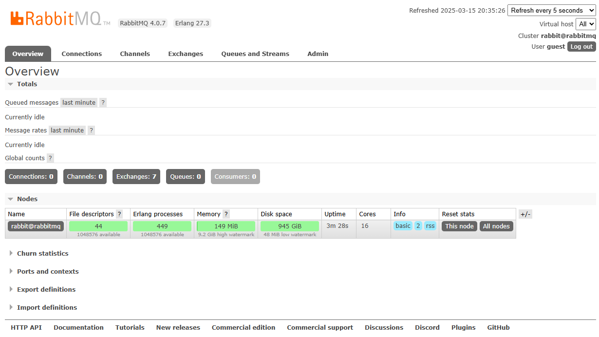
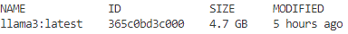

<<<<<<< HEAD
=======
<<<<<<< HEAD
# RabbitMail
RabbitMail automates email processing and sentiment analysis. It retrieves unread Gmail messages, cleans them with Llama3, analyzes sentiment, and publishes negative emails to RabbitMQ using a fanout exchange for multiple consumers.
=======
>>>>>>> 7fb05e4 (Resolve merge conflicts)
# Automating Email Processing and Sentiment Analysis with RabbitMQ, Ollama, and Gmail API  

## 1. Introduction  
Automating email processing and sentiment analysis can significantly improve efficiency in handling large volumes of emails. In this article, I will walk you through a complete solution for:  

- Fetching emails using the `Gmail API`  
- Cleaning and formatting email content with `Ollama`  
- Analyzing the sentiment of emails using `Ollama`  
- Using `RabbitMQ` to handle message queues and communication between services  
- Sending negative sentiment alerts via `SMTP`  

We’ll set up the entire solution using `Docker`, and you’ll have a fully functional pipeline at the end.  

## 2. Architecture Overview  
The architecture consists of three main components:  

- **RPC Server** – Fetches the latest unread email from `Gmail` using the `Gmail API`  
- **RPC Client** – Sends the email content to `Ollama` for cleaning and sentiment analysis  
- **Worker** – Handles negative sentiment emails and sends alerts via `SMTP`
- Communication between services is managed using `RabbitMQ` queues.  

### RabbitMQ and RPC Integration  
`RabbitMQ` serves as the central messaging broker, enabling communication between the components.  

- The **RPC (Remote Procedure Call)** mechanism allows the `RPC Client` to request and receive email data from the `RPC Server` through `RabbitMQ` queues.  
- `RabbitMQ` ensures asynchronous communication and reliable message delivery, making the system more scalable and fault-tolerant.  
- This architecture allows multiple services to work together seamlessly without direct dependencies, increasing overall system flexibility. 

## 3. Setting Up the Environment  

### 3.1. Setting Up RabbitMQ with Docker  
Start `RabbitMQ` using the official `Docker` image:  

```bash
docker run -d --hostname rabbitmq --name RabbitMQ -p 15672:15672 rabbitmq:4.0.7-management
```

At this point, you can access the **RabbitMQ Management UI** by opening your browser and going to:  

👉 `http://localhost:15672`  

The default username and password are `guest/guest`.  

  

### 3.2. Setting Up Ollama (Llama3)  
Install `Ollama` and pull the `Llama3` model:  

```bash
# Install Ollama
docker run -d --name ollama -p 11434:11434 ollama/ollama

# Pull the Llama3 model in Ollama Docker container
docker exec -it ollama ollama pull llama3
```

To verify that `Ollama` is running, you can test the installation with the following command in `Ollama` `Docker` container:  

```bash
docker exec -it ollama ollama list
```



### 3.3. Get Google API Credentials  
To access **Gmail**, you need to create **Google API** credentials:  

1. Go to the **Google Cloud Console**.  
2. From the left-hand menu, navigate to **APIs & Services** → **Library**.  
3. Enable the **Gmail API**.  
4. From the left-hand menu, navigate to **APIs & Services** → **Credentials**.  
5. Click on **Create Credentials** and select **OAuth Client ID**.  
    - Set the **Application type** to **Desktop App**.  
    - Download the `credentials.json` file.  
    - Save the file as `credentials.json` in your working directory.  
6. From the **Credentials** tab, click on the client name you just created to open the details.  
7. Go to the **OAuth Consent Screen** → **Audience** → **Test Users** → **Add Users** and add your email address.  

> **⚠️ Note:** If you don't add your email address in the Test Users section, you will get an authorization error.

## 4. Create the RPC Server  
The `RPC server` will fetch emails using the `Gmail API` and push them to `RabbitMQ`.  

### 4.1. `rpc_server.py`  
Here’s the core logic for fetching emails and sending them to `RabbitMQ`:  

- Authenticate with the `Gmail API`  
- Fetch the latest unread email  
- Mark the email as read  
- Send the email content to `RabbitMQ`  

```python
import re
import os
import base64
import json
from googleapiclient.discovery import build
from google.oauth2.credentials import Credentials
from dotenv import load_dotenv
import pika

# Load environment variables from .env file
load_dotenv()

CREDENTIALS_FILE = os.getenv('CREDENTIALS_FILE')
TOKEN_FILE = os.getenv('TOKEN_FILE')
TARGET_EMAIL = os.getenv('TARGET_EMAIL')

SCOPES = [
    'https://www.googleapis.com/auth/gmail.readonly',
    'https://www.googleapis.com/auth/gmail.modify'
]

def get_gmail_service():
    """
    Authenticate and return a Gmail service instance.
    
    If the token file exists, it will use the existing credentials.
    If not, it will prompt for login and create a new token file.
    
    Returns:
        service (googleapiclient.discovery.Resource): Authenticated Gmail service object
    """
    creds = None
    if os.path.exists(TOKEN_FILE):
        creds = Credentials.from_authorized_user_file(TOKEN_FILE, SCOPES)
    else:
        from google_auth_oauthlib.flow import InstalledAppFlow
        flow = InstalledAppFlow.from_client_secrets_file(CREDENTIALS_FILE, SCOPES)
        creds = flow.run_local_server(port=0)
        with open(TOKEN_FILE, 'w') as token:
            token.write(creds.to_json())

    return build('gmail', 'v1', credentials=creds)

def get_latest_unread_email():
    """
    Fetch the latest unread email from the target inbox.

    Returns:
        dict: A dictionary containing 'sender' and 'body' keys.
              If no new email is found, returns {'sender': None, 'body': None}.
    """
    service = get_gmail_service()
    if not service:
        return {"sender": None, "body": None}

    print("INFO: Checking for new unread emails...")

    try:
        # Search for unread emails in the inbox that are not from no-reply addresses
        results = service.users().messages().list(
            userId='me',
            labelIds=['INBOX'],
            q=f'is:unread to:{TARGET_EMAIL} -from:no-reply@accounts.google.com',
            maxResults=1
        ).execute()

        messages = results.get('messages', [])
        if not messages:
            return {"sender": None, "body": None}

        message_id = messages[0]['id']

        # Get the email content using the message ID
        msg = service.users().messages().get(userId='me', id=message_id).execute()
        payload = msg['payload']

        # Extract the sender's email address from the headers
        headers = payload.get('headers', [])
        sender = next((header['value'] for header in headers if header['name'] == 'From'), None)

        # Extract the email body
        body = ""
        if 'parts' in payload:
            for part in payload['parts']:
                if part['mimeType'] == 'text/plain':
                    body = base64.urlsafe_b64decode(part['body']['data']).decode("utf-8", "ignore")
                    break
        elif 'body' in payload:
            body = base64.urlsafe_b64decode(payload['body']['data']).decode("utf-8", "ignore")

        # Handle encoding issues
        try:
            sender = sender.encode('utf-8').decode('utf-8', 'ignore') if sender else None
            body = body.encode('utf-8').decode('utf-8', 'ignore') if body else None

            if sender:
                match = re.search(r'<(.+?)>', sender)
                if match:
                    sender = match.group(1)

        except Exception as e:
            print(f"ERROR: Encoding error: {e}")

        # Mark the email as read
        service.users().messages().modify(
            userId='me',
            id=message_id,
            body={'removeLabelIds': ['UNREAD']}
        ).execute()

        if sender and body:            
            print(sender, body)
            return {"sender": sender, "body": body}
        else:
            print(sender, body)
            return {"sender": None, "body": None}

    except Exception as e:
        print(f"ERROR: Error while reading email: {e}")
        return {"sender": None, "body": None}

def on_request(ch, method, props, body):
    """
    Handle incoming RabbitMQ requests and process them.
    
    Args:
        ch: RabbitMQ channel
        method: RabbitMQ method
        props: RabbitMQ properties
        body: Message body
    """
    print("INFO: Processing new email request...")
    email = get_latest_unread_email()

    # Respond with the email content if available, otherwise notify no new messages
    response = json.dumps(email, ensure_ascii=False).encode('utf-8') if email["sender"] and email["body"] else b"No new messages"

    # Publish response back to the client
    ch.basic_publish(
        exchange='',
        routing_key=props.reply_to,
        properties=pika.BasicProperties(correlation_id=props.correlation_id),
        body=response
    )
    # Acknowledge the message
    ch.basic_ack(delivery_tag=method.delivery_tag)

# Establish connection with RabbitMQ server
connection = pika.BlockingConnection(pika.ConnectionParameters('localhost'))
channel = connection.channel()

# Declare the RPC queue
channel.queue_declare(queue='rpc_queue_v5', durable=True)

# Start consuming messages from the queue
channel.basic_consume(queue='rpc_queue_v5', on_message_callback=on_request)

print("INFO: Listening for requests...")
channel.start_consuming()
```
## 5. Create the RPC Client  
The `RPC client` will process the fetched email by sending it to `Ollama` for cleaning and sentiment analysis.  

### 5.1. `rpc_client.py`  
Here’s the core logic for cleaning the email content, analyzing sentiment, and sending negative emails to `RabbitMQ`:  

- **Clean the email content using `Ollama`**  
   - Cleaning ensures that unnecessary signatures, formatting, and special characters are removed.  
   - Cleaned content helps improve the accuracy of sentiment analysis.  

- **Perform sentiment analysis using `Ollama`**  
   - Sentiment is classified as positive, negative, or neutral.  
   - If sarcasm is detected, the sentiment is set to negative.  

- **If the sentiment is negative, push the email to `RabbitMQ`**  
   - Only negative emails are forwarded to `RabbitMQ` for further processing.  

```Python
import os
import json
import requests
from dotenv import load_dotenv
import pika
import uuid
import time

# Load environment variables from .env file
load_dotenv()

LLAMA_URL = "http://localhost:11434/api/generate"

class GmailRpcClient:
    """
    A RabbitMQ RPC Client for fetching emails from Gmail.
    
    This class connects to RabbitMQ, sends a request to get the latest unread email, 
    and waits for a response with the email content.
    """
    def __init__(self):
        print("INFO: Connecting to RabbitMQ...")
        self.connection = pika.BlockingConnection(pika.ConnectionParameters('localhost'))
        self.channel = self.connection.channel()

        # Create a unique callback queue for receiving responses
        result = self.channel.queue_declare(queue='', exclusive=True)
        self.callback_queue = result.method.queue

        # Listen for responses on the callback queue
        self.channel.basic_consume(
            queue=self.callback_queue,
            on_message_callback=self.on_response,
            auto_ack=True
        )

        self.response = None
        self.corr_id = None

        print("INFO: RabbitMQ connection established.")

    def on_response(self, ch, method, props, body):
        """
        Handle the response from RabbitMQ.

        Args:
            ch: RabbitMQ channel
            method: RabbitMQ method
            props: RabbitMQ properties
            body: Message body
        """
        if self.corr_id == props.correlation_id:
            self.response = body.decode()

    def call(self):
        """
        Send a request to RabbitMQ to get the latest unread email.

        Returns:
            str: Email content or "No new messages" if no new email is found.
        """
        self.response = None
        self.corr_id = str(uuid.uuid4())

        # Send a message to RabbitMQ
        self.channel.basic_publish(
            exchange='',
            routing_key='rpc_queue_v5',  
            properties=pika.BasicProperties(
                reply_to=self.callback_queue,
                correlation_id=self.corr_id,
            ),
            body=''
        )

        # Wait for response from RabbitMQ
        while self.response is None:
            self.connection.process_data_events(time_limit=None)

        return self.response

# Function to clean up the message using Llama3
def clean_with_llama(content):
    """
    Clean up the email content using Llama3.

    Args:
        content (str): Raw email content

    Returns:
        dict: Cleaned email content with 'sender' and 'body'
    """
    print(f"INFO: Sending the following message to Llama3:\n{content}")

    try:
        content = content.encode('utf-8', 'ignore').decode('utf-8')

        response = requests.post(
            LLAMA_URL,
            json={
                "model": "llama3",
                "prompt": (
                    "Clean: Format the following message in a clean and structured way. "
                    "Remove unnecessary signatures, special characters, and extra spaces. "
                    "Respond strictly in the following JSON format:\n"
                    "{ \"sender\": \"<Sender>\", \"body\": \"<Cleaned Content>\" }\n\n"
                    "Message:\n"
                    f"{content}"
                ),
                "stream": False
            }
        )

        result = response.json().get("response", "").strip()
        print(f"INFO: Llama3 response:\n{result}")

        # Parse the response from Llama3
        clean_message = parse_llama_response(result)
        if clean_message:
            print(f"INFO: Cleaned message: {clean_message}")
            return clean_message
        else:
            print("ERROR: Invalid response from Llama3 or missing format.")
            return None

    except Exception as e:
        print(f"ERROR: Llama3 cleaning error: {e}")
        return None

# Function to analyze sentiment using Llama3
def analyze_sentiment_with_llama(content):
    """
    Analyze the sentiment of the email using Llama3.

    Args:
        content (str): Email body content

    Returns:
        str: "positive", "negative", or "neutral"
    """
    print(f"INFO: Sending the following message to Llama3 for sentiment analysis:\n{content}")

    try:
        response = requests.post(
            LLAMA_URL,
            json={
                "model": "llama3",
                "prompt": (
                    "Analyze the sentiment of this message. If the message contains sarcasm, irony, or mockery, "
                    "consider it as negative. Respond strictly in the following JSON format. Do not provide any explanations:\n"
                    "{ \"sentiment\": \"positive\" | \"negative\" | \"neutral\", \"sarcasm\": true | false }\n\n"
                    f"Message:\n{content}"
                ),
                "stream": False
            }
        )

        result = response.json().get("response", "").strip()
        print(f"INFO: Sentiment analysis response from Llama3:\n{result}")

        # Parse JSON response
        sentiment_data = json.loads(result.replace("'", "\""))
        sentiment = sentiment_data.get("sentiment", "").lower()
        sarcasm = sentiment_data.get("sarcasm", False)

        if sarcasm:
            sentiment = "negative"

        return sentiment

    except Exception as e:
        print(f"ERROR: Sentiment analysis error: {e}")
        return None


def parse_llama_response(result):
    """
    Parse the JSON response from Llama3.

    Args:
        result (str): Raw JSON string from Llama3

    Returns:
        dict: Parsed JSON object containing 'sender' and 'body'
    """
    try:
        if "{" in result and "}" in result:
            json_part = result[result.index("{"):result.rindex("}") + 1]
            json_part = json_part.replace("'", "\"")
            json_part = json_part.replace("\n", " ").replace("\r", " ").replace("\t", " ")

            message = json.loads(json_part, strict=False)
            if isinstance(message, dict) and 'sender' in message and 'body' in message:
                return message
            else:
                raise ValueError("Invalid JSON format")
        else:
            raise ValueError("No valid JSON found in the response")

    except Exception as e:
        print(f"ERROR: JSON parsing error: {e}")
        return None


# Send message to RabbitMQ
def send_to_rabbitmq(message):
    """
    Send the processed message to RabbitMQ.

    Args:
        message (dict): Cleaned and processed email content
    """
    connection = pika.BlockingConnection(pika.ConnectionParameters('localhost'))
    channel = connection.channel()

    channel.queue_declare(queue='email_alerts_v5', durable=True)

    channel.basic_publish(
        exchange='',
        routing_key='email_alerts_v5',
        body=json.dumps(message)
    )

    connection.close()

if __name__ == "__main__":
    rpc_client = GmailRpcClient()

    while True:
        # Get new email
        email_content = rpc_client.call()

        if email_content != "No new messages":
            # Clean the email content
            message = clean_with_llama(email_content)
            if message and message.get("sender") and message.get("body"):
                # Perform sentiment analysis
                sentiment = analyze_sentiment_with_llama(message.get("body"))

                if sentiment:
                    print(f"INFO: Sentiment: {sentiment}")

                    if sentiment == "negative":
                        send_to_rabbitmq(message)
                        print("INFO: Negative message sent to RabbitMQ.")
                    else:
                        print(f"INFO: Message sentiment '{sentiment}', not processed.")
                else:
                    print("ERROR: Sentiment not determined.")

        time.sleep(10)
```

## 6. Create the Worker  
The `Worker` will handle the email content and send alerts using `SMTP`.  

### 6.1. `rabbitmq_worker.py`  
Here’s the core logic for processing the email content and sending alerts:  

- **Receive email content from `RabbitMQ`**  
   - The worker listens to the `RabbitMQ` queue for incoming messages.  
   - If the message is properly formatted, it will extract the email content and sender.  

- **Format the email content**  
   - The email content is converted into an `HTML` format for better presentation.  
   - This makes the alert email visually more readable.  

- **Send an email alert using `SMTP`**  
   - The formatted email is sent using the `SMTP` server.  
   - If the `SMTP` connection fails, the worker will retry automatically.  

```Python
import pika
import smtplib
from email.mime.text import MIMEText
import os
from dotenv import load_dotenv
from datetime import datetime
import json
import time

# Load environment variables from .env file
load_dotenv()

SMTP_SERVER = os.getenv('SMTP_SERVER')
SMTP_PORT = int(os.getenv('SMTP_PORT'))
EMAIL_ADDRESS = os.getenv('EMAIL_ADDRESS')
EMAIL_PASSWORD = os.getenv('EMAIL_PASSWORD')
ALERT_RECIPIENT = os.getenv('ALERT_RECIPIENT')

def format_email(sender, body):
    """
    Format the email content into an HTML structure.

    Args:
        sender (str): Email sender's address
        body (str): Email body content

    Returns:
        str: Formatted HTML content for the email
    """
    timestamp = datetime.now().strftime("%Y-%m-%d %H:%M:%S")

    html = f"""
    <html>
        <body>
            <h2>Negative Email Alert</h2>
            <p><strong>From:</strong> {sender}</p>
            <p><strong>Time:</strong> {timestamp}</p>
            <hr>
            <p>{body}</p>
        </body>
    </html>
    """
    return html

def send_email_alert(sender, body):
    """
    Send an email alert using SMTP.

    Args:
        sender (str): Email sender's address
        body (str): Email body content
    """
    try:
        # Create the email message
        msg = MIMEText(format_email(sender, body), 'html')
        msg["From"] = EMAIL_ADDRESS
        msg["To"] = ALERT_RECIPIENT
        msg["Subject"] = "Negative Email Alert"

        # Connect to SMTP server and send the email
        with smtplib.SMTP(SMTP_SERVER, SMTP_PORT) as server:
            server.starttls()
            server.login(EMAIL_ADDRESS, EMAIL_PASSWORD)
            server.sendmail(EMAIL_ADDRESS, ALERT_RECIPIENT, msg.as_string())

        print(f"INFO: Email alert sent to {ALERT_RECIPIENT}")

    except Exception as e:
        print(f"ERROR: Failed to send email: {e}")

def on_message(ch, method, properties, body):
    """
    Handle incoming messages from RabbitMQ.

    Args:
        ch: RabbitMQ channel
        method: RabbitMQ method
        properties: RabbitMQ properties
        body: Message body (JSON format)
    """
    try:
        # Decode and parse the JSON message
        message = json.loads(body.decode())
        sender = message.get("sender")
        body = message.get("body")

        if sender and body:
            print(f"INFO: New message received from: {sender}")
            # Send email alert
            send_email_alert(sender, body)
            # Acknowledge the message
            ch.basic_ack(delivery_tag=method.delivery_tag)
            print("INFO: Email successfully processed and removed from queue.")
        else:
            print("ERROR: Invalid message format. Missing sender or body.")
            # Reject the message and do not requeue
            ch.basic_nack(delivery_tag=method.delivery_tag, requeue=False)

    except json.JSONDecodeError as e:
        print(f"ERROR: JSON format error: {e}")
        # Reject the message and do not requeue
        ch.basic_nack(delivery_tag=method.delivery_tag, requeue=False)

    except Exception as e:
        print(f"ERROR: Message processing error: {e}")
        # Reject the message and requeue it for another attempt
        ch.basic_nack(delivery_tag=method.delivery_tag, requeue=True)

def connect_to_rabbitmq():
    """
    Connect to RabbitMQ and listen for messages.
    """
    while True:
        try:
            print("INFO: Connecting to RabbitMQ...")
            # Connect to RabbitMQ server
            connection = pika.BlockingConnection(pika.ConnectionParameters('localhost'))
            channel = connection.channel()

            # Declare the queue (durable to survive broker restarts)
            channel.queue_declare(queue='email_alerts_v5', durable=True)

            # Start consuming messages from the queue
            channel.basic_consume(queue='email_alerts_v5', on_message_callback=on_message)
            print("INFO: Listening for incoming messages...")
            channel.start_consuming()

        except KeyboardInterrupt:
            print("INFO: Program stopped manually.")
            connection.close()
            break

        except Exception as e:
            print(f"ERROR: RabbitMQ connection error: {e}")
            # Wait for 5 seconds before retrying connection
            time.sleep(5)

if __name__ == "__main__":
    connect_to_rabbitmq()

```

## 7. Testing the Pipeline  
To test the pipeline, I sent four test emails to my `Gmail` account defined in `TARGET_EMAIL`:  

- *"Sunumda her ne kadar beni hiç biriniz dinlemiş olsa da geldiğiniz için yine de teşekkür ederim."*  
   - This email was correctly identified as `sarcastic` marked as `negative` — An alert was sent to `ALERT_RECIPIENT`.  

- *"Sunuma iştirak ettiğiniz için hepinize teşekkür ederim."*  
   - This email was identified as `positive` — No alert was triggered.  

- *"Sunuma hiç kimse gelmedi. Çok sinirlendim."*  
   - This email was correctly identified as `negative` — An alert was sent to `ALERT_RECIPIENT`.  

- *"Tabii ki bu işin bu kadar karmaşık olacağını kim düşünebilirdi ki? Harika ilerliyoruz gerçekten, bravo bize!"*  
   - This email was correctly identified as `sarcastic` and marked as `negative` — An alert was sent to `ALERT_RECIPIENT`.  

## 8. Conclusion  
We’ve built a complete end-to-end solution to automate email processing using `Gmail API`, `Ollama`, `RabbitMQ`, and `SMTP`.  

### Key Achievements  
- The pipeline successfully handled real-world email processing scenarios, including sarcastic and negative sentiment analysis.  
- The system accurately distinguished between positive, negative, and sarcastic emails.  
- The use of `RabbitMQ's RPC mechanism` demonstrated how effective asynchronous communication can be in handling complex workflows.  

### Future Improvements  
- **Enhanced Llama Integration** – Improve sarcasm detection and multi-language support.  
- **Adaptive Learning** – Learn from feedback and adjust sentiment detection.  
- **Multi-Agent Architecture** – Allow parallel processing for more complex agent networks.  
- **Contextual Awareness** – Improve sentiment accuracy with conversation history.  

<<<<<<< HEAD
This solution serves as a foundational step toward building a fully autonomous `Agentic AI` system.
=======
This solution serves as a foundational step toward building a fully autonomous `Agentic AI` system.
>>>>>>> 116463f (Initial commit)
>>>>>>> 7fb05e4 (Resolve merge conflicts)
